---
## Front matter
title: "Отчёта по лабораторной работе 3"
subtitle: "Архитектура компьютеров и операционные системы"
author: "Кенан Гашимов НКАБд-02-23"

## Generic otions
lang: ru-RU
toc-title: "Содержание"

## Bibliography
bibliography: bib/cite.bib
csl: pandoc/csl/gost-r-7-0-5-2008-numeric.csl

## Pdf output format
toc: true # Table of contents
toc-depth: 2
lof: true # List of figures
lot: true # List of tables
fontsize: 12pt
linestretch: 1.5
papersize: a4
documentclass: scrreprt
## I18n polyglossia
polyglossia-lang:
  name: russian
  options:
	- spelling=modern
	- babelshorthands=true
polyglossia-otherlangs:
  name: english
## I18n babel
babel-lang: russian
babel-otherlangs: english
## Fonts
mainfont: PT Serif
romanfont: PT Serif
sansfont: PT Sans
monofont: PT Mono
mainfontoptions: Ligatures=TeX
romanfontoptions: Ligatures=TeX
sansfontoptions: Ligatures=TeX,Scale=MatchLowercase
monofontoptions: Scale=MatchLowercase,Scale=0.9
## Biblatex
biblatex: true
biblio-style: "gost-numeric"
biblatexoptions:
  - parentracker=true
  - backend=biber
  - hyperref=auto
  - language=auto
  - autolang=other*
  - citestyle=gost-numeric
## Pandoc-crossref LaTeX customization
figureTitle: "Рис."
tableTitle: "Таблица"
listingTitle: "Листинг"
lofTitle: "Список иллюстраций"
lotTitle: "Список таблиц"
lolTitle: "Листинги"
## Misc options
indent: true
header-includes:
  - \usepackage{indentfirst}
  - \usepackage{float} # keep figures where there are in the text
  - \floatplacement{figure}{H} # keep figures where there are in the text
---

# Цель работы

Освоение процессом оформления отчетов с использованием простого языка разметки Markdown.

# Ход работы

Установил программы pandoc и TexLive согласно указаниям в лабораторной работе.
Открыл терминал.

Перешел в каталог курса, который был создан при выполнении лабораторной работы №3. Обновил локальный репозиторий, загрузив изменения из удаленного репозитория.
Затем перешел в каталог с шаблоном отчета для лабораторной работы №3.

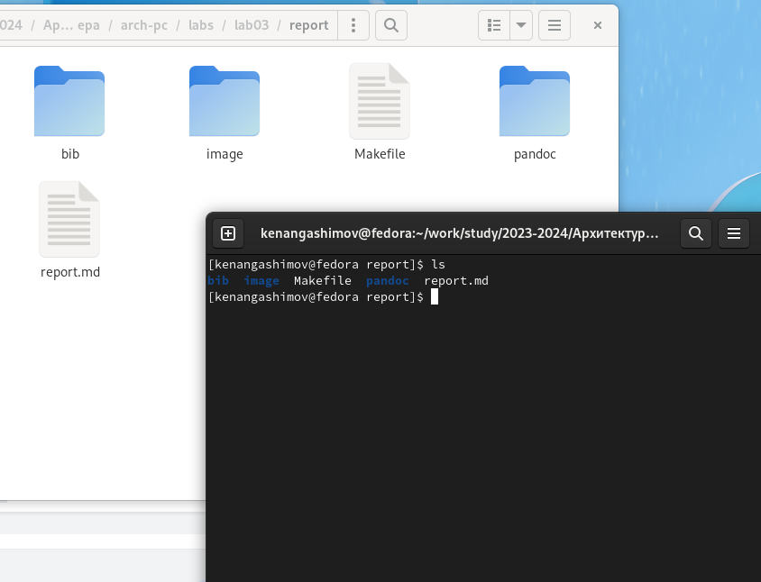{ #fig:001 width=70%, height=70% }

Выполнил компиляцию шаблона с использованием Makefile, введя команду make.

Оказалось, что не хватает шрифтов. После установки нескольких шрифтов произошла компиляция.
 
После успешной компиляции были созданы файлы report.pdf и report.docx. 
Я открыл и проверил полученные файлы на корректность. 

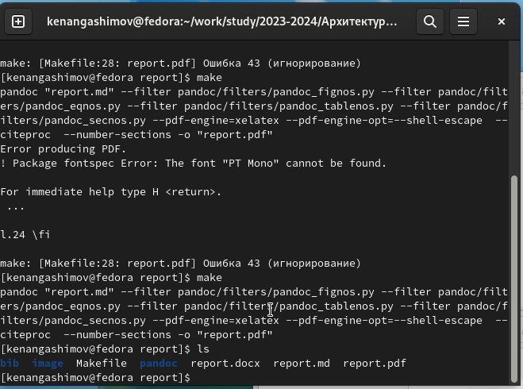{ #fig:002 width=70%, height=70% }

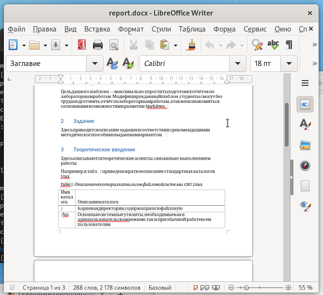{ #fig:003 width=70%, height=70% }

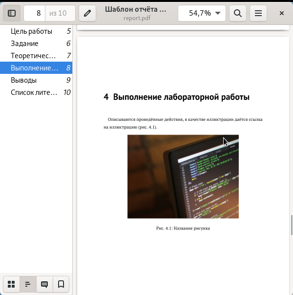{ #fig:004 width=70%, height=70% }

Удалил созданные файлы с использованием команды make clean в Makefile. 
Проверил, что после выполнения этой команды файлы report.pdf и report.docx были удалены.

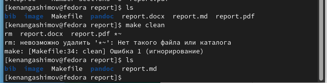{ #fig:005 width=70%, height=70% }

Открыл файл report.md с помощью текстового редактора gedit и внимательно изучил его структуру.

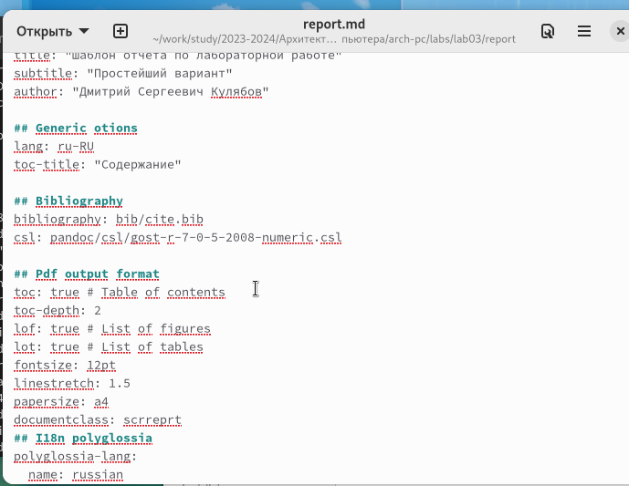{ #fig:006 width=70%, height=70% }

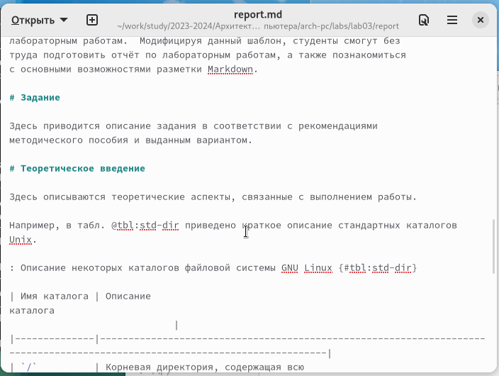{ #fig:007 width=70%, height=70% }

Заполнил отчет и скомпилировал его с использованием Makefile. Проверил корректность полученных файлов.

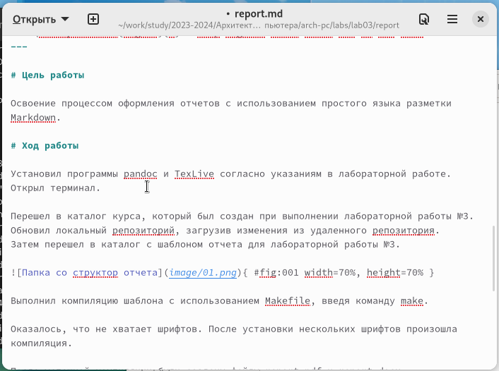{ #fig:008 width=70%, height=70% }

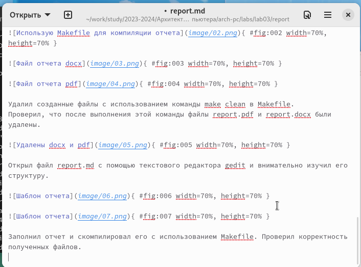{ #fig:009 width=70%, height=70% }

Также я выполнил самостоятельное задание и заполнил отчет в формате Markdown для лабораторной работы номер 2.

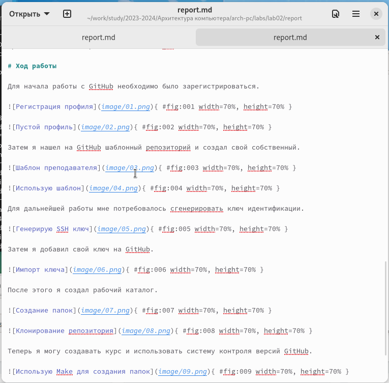{ #fig:010 width=70%, height=70% }

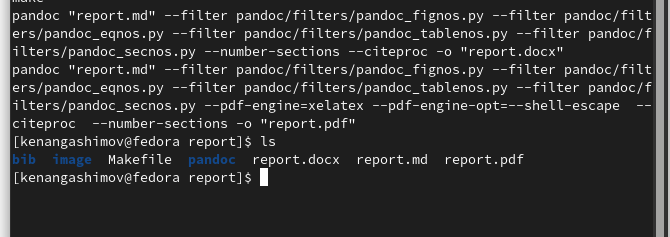{ #fig:011 width=70%, height=70% }

Загрузил файлы на Github.

# Выводы

В ходе работы мы изучили синтаксис языка разметки Markdown и научились создавать структурированные отчеты с его помощью.
