---
## Front matter
title: "Отчёта по лабораторной работе 5"
subtitle: "Архитектура компьютеров и операционные системы"
author: "Кенан Гашимов НКАБд-02-23"

## Generic otions
lang: ru-RU
toc-title: "Содержание"

## Bibliography
bibliography: bib/cite.bib
csl: pandoc/csl/gost-r-7-0-5-2008-numeric.csl

## Pdf output format
toc: true # Table of contents
toc-depth: 2
lof: true # List of figures
lot: true # List of tables
fontsize: 12pt
linestretch: 1.5
papersize: a4
documentclass: scrreprt
## I18n polyglossia
polyglossia-lang:
  name: russian
  options:
	- spelling=modern
	- babelshorthands=true
polyglossia-otherlangs:
  name: english
## I18n babel
babel-lang: russian
babel-otherlangs: english
## Fonts
mainfont: PT Serif
romanfont: PT Serif
sansfont: PT Sans
monofont: PT Mono
mainfontoptions: Ligatures=TeX
romanfontoptions: Ligatures=TeX
sansfontoptions: Ligatures=TeX,Scale=MatchLowercase
monofontoptions: Scale=MatchLowercase,Scale=0.9
## Biblatex
biblatex: true
biblio-style: "gost-numeric"
biblatexoptions:
  - parentracker=true
  - backend=biber
  - hyperref=auto
  - language=auto
  - autolang=other*
  - citestyle=gost-numeric
## Pandoc-crossref LaTeX customization
figureTitle: "Рис."
tableTitle: "Таблица"
listingTitle: "Листинг"
lofTitle: "Список иллюстраций"
lotTitle: "Список таблиц"
lolTitle: "Листинги"
## Misc options
indent: true
header-includes:
  - \usepackage{indentfirst}
  - \usepackage{float} # keep figures where there are in the text
  - \floatplacement{figure}{H} # keep figures where there are in the text
---

# Цель работы

Целью работы является приобретение практических навыков работы в Midnight Commander. 
Освоение инструкций языка ассемблера mov и int.

# Выполнение лабораторной работы

Я открыл Midnight Commander и перешел в каталог ~/work/arch-pc. Затем я создал каталог с именем lab05.

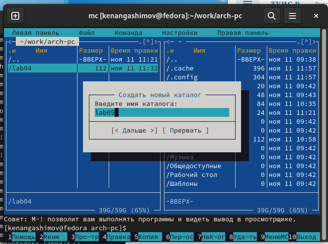{ #fig:001 width=70%, height=70% }

Создал файл с именем lab05-1.asm.

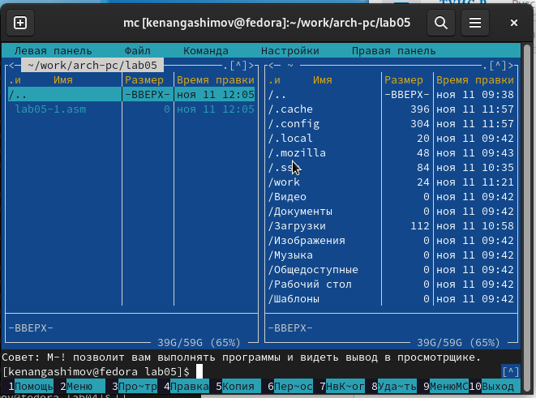{ #fig:002 width=70%, height=70% }

Открыл файл для редактирования и написал код программы.

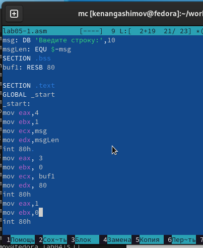{ #fig:003 width=70%, height=70% }

Открыл файл для просмотра и убедился, что он содержит написанный код.

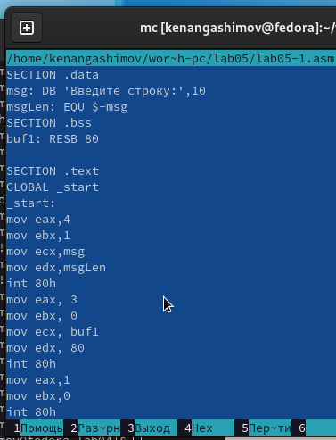{ #fig:004 width=70%, height=70% }

Получил исполняемый файл программы и проверил его работу.

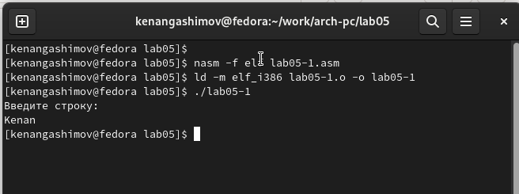{ #fig:005 width=70%, height=70% }

Скачал файл in_out.asm и добавил его в рабочий каталог. Затем скопировал содержимое файла lab05-1.asm в файл lab05-2.asm.

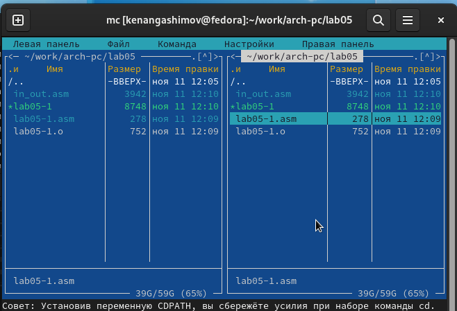{ #fig:006 width=70%, height=70% }

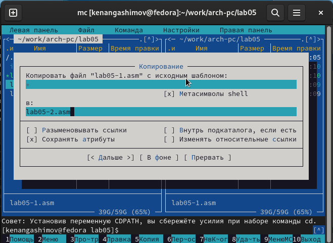{ #fig:007 width=70%, height=70% }

Написал код программы lab05-2.asm. Затем скомпилировал программу и проверил ее запуск.

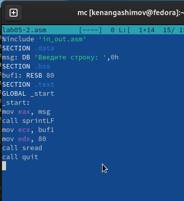{ #fig:008 width=70%, height=70% }

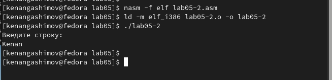{ #fig:009 width=70%, height=70% }

В файле lab5-2.asm я заменил вызов подпрограммы sprintLF на sprint. Затем я снова собрал исполняемый файл. Теперь после вывода строки она не завершается символом перехода на новую строку.

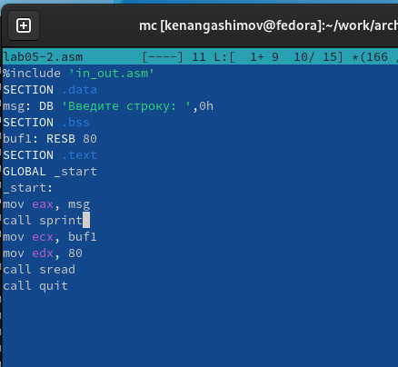{ #fig:010 width=70%, height=70% }

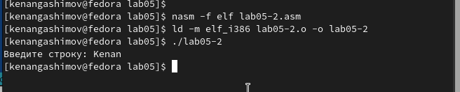{ #fig:011 width=70%, height=70% }

Также я скопировал программу lab05-1.asm и внес соответствующие изменения в код, чтобы программа выводила приглашение типа "Введите строку:", затем считывала строку с клавиатуры и выводила введенную строку на экран.

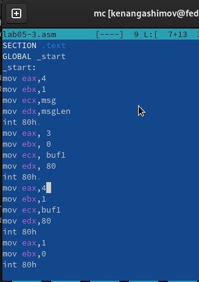{ #fig:012 width=70%, height=70% }

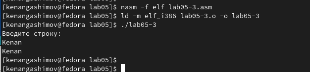{ #fig:013 width=70%, height=70% }

Аналогично изменил программу lab05-2.asm.

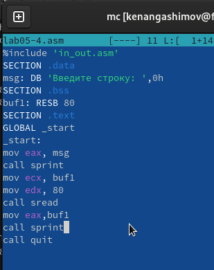{ #fig:014 width=70%, height=70% }

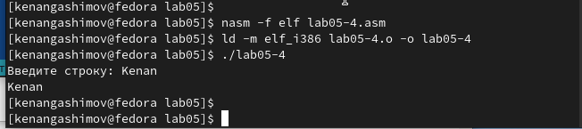{ #fig:015 width=70%, height=70% }

Отличие этих двух реализаций заключается в том, что файл in_out.asm содержит уже готовые подпрограммы для обеспечения ввода/вывода. Таким образом, нам остается только разместить данные в нужных регистрах и вызвать желаемую подпрограмму с помощью инструкции call.

# Выводы

Научились писать базовые ассемблерные программы. Освоили ассемблерные инструкции mov и int.
