---
## Front matter
title: "Отчёта по лабораторной работе 6"
subtitle: "Архитектура компьютеров и операционные системы"
author: "Кенан Гашимов НКАБд-02-23"

## Generic otions
lang: ru-RU
toc-title: "Содержание"

## Bibliography
bibliography: bib/cite.bib
csl: pandoc/csl/gost-r-7-0-5-2008-numeric.csl

## Pdf output format
toc: true # Table of contents
toc-depth: 2
lof: true # List of figures
lot: true # List of tables
fontsize: 12pt
linestretch: 1.5
papersize: a4
documentclass: scrreprt
## I18n polyglossia
polyglossia-lang:
  name: russian
  options:
	- spelling=modern
	- babelshorthands=true
polyglossia-otherlangs:
  name: english
## I18n babel
babel-lang: russian
babel-otherlangs: english
## Fonts
mainfont: PT Serif
romanfont: PT Serif
sansfont: PT Sans
monofont: PT Mono
mainfontoptions: Ligatures=TeX
romanfontoptions: Ligatures=TeX
sansfontoptions: Ligatures=TeX,Scale=MatchLowercase
monofontoptions: Scale=MatchLowercase,Scale=0.9
## Biblatex
biblatex: true
biblio-style: "gost-numeric"
biblatexoptions:
  - parentracker=true
  - backend=biber
  - hyperref=auto
  - language=auto
  - autolang=other*
  - citestyle=gost-numeric
## Pandoc-crossref LaTeX customization
figureTitle: "Рис."
tableTitle: "Таблица"
listingTitle: "Листинг"
lofTitle: "Список иллюстраций"
lotTitle: "Список таблиц"
lolTitle: "Листинги"
## Misc options
indent: true
header-includes:
  - \usepackage{indentfirst}
  - \usepackage{float} # keep figures where there are in the text
  - \floatplacement{figure}{H} # keep figures where there are in the text
---

# Цель работы

Целью работы является освоение арифметических инструкций языка ассемблера NASM.

# Выполнение лабораторной работы

Я создал каталог для программ лабораторной работы № 6, перешел в него и создал файл lab6-1.asm.

Давайте рассмотрим примеры программ, которые выводят символьные и числовые значения. В этих программах значения будут записываться в регистр eax.

В данной программе мы записываем символ '6' в регистр eax (mov eax, '6'), а символ '4' в регистр ebx (mov ebx, '4').
Затем мы добавляем значение регистра ebx к значению в регистре eax (add eax, ebx, результат сложения записывается в регистр eax).
После этого мы выводим результат.
Однако, для работы функции sprintLF, необходимо, чтобы в регистре eax был записан адрес, поэтому мы используем дополнительную переменную.
Мы записываем значение регистра eax в переменную buf1 (mov [buf1], eax),
а затем записываем адрес переменной buf1 в регистр eax (mov eax, buf1) и вызываем функцию sprintLF.

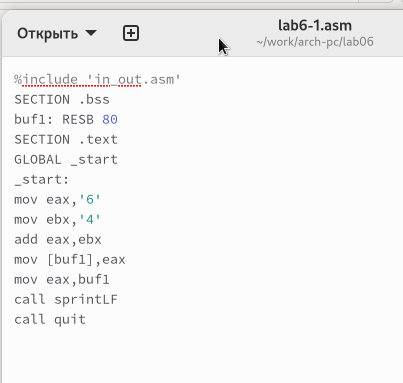{ #fig:001 width=70%, height=70% }

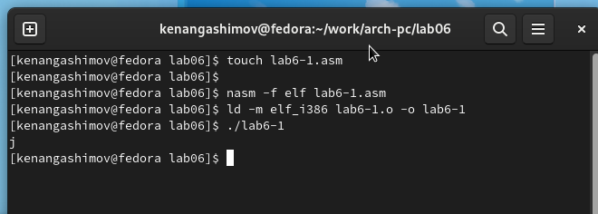{ #fig:002 width=70%, height=70% }

В данном случае, когда мы ожидаем увидеть число 10 при выводе значения регистра eax, фактическим результатом будет символ 'j'.
Это происходит из-за того, что код символа '6' равен 00110110 в двоичном представлении (или 54 в десятичном представлении),
а код символа '4' равен 00110100 (или 52 в десятичном представлении).
Когда мы выполняем команду add eax, ebx, результатом будет сумма кодов - 01101010 (или 106 в десятичном представлении),
который соответствует символу 'j'.

Далее изменяю текст программы и вместо символов, запишем в регистры числа. 

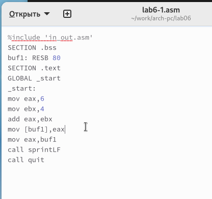{ #fig:003 width=70%, height=70% }

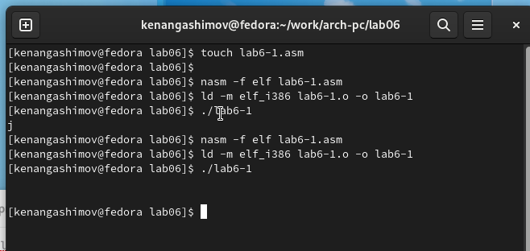{ #fig:004 width=70%, height=70% }

При изменении текста программы и записи чисел в регистры, мы также не получим число 10 
при выполнении программы. Вместо этого будет выведен символ с кодом 10, который 
представляет собой символ конца строки (возврат каретки). В консоли этот символ 
не отображается, но он добавляет пустую строку.

Как уже было отмечено ранее, в файле in_out.asm реализованы подпрограммы для 
преобразования ASCII символов в числа и обратно. Я преобразовал текст программы, 
используя эти функции.

{ #fig:005 width=70%, height=70% }

{ #fig:006 width=70%, height=70% }

В результате выполнения программы мы получим число 106. В данном случае, как и в 
первом случае, команда add складывает коды символов '6' и '4' (54+52=106). Однако, 
в отличие от предыдущей программы, функция iprintLF позволяет вывести число, 
а не символ, кодом которого является это число.

Аналогично предыдущему примеру изменим символы на числа.

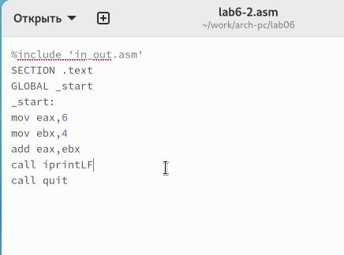{ #fig:007 width=70%, height=70% }

Функция iprintLF позволяет вывести число и операндами были числа (а не коды символов).
Поэтому получаем число 10.

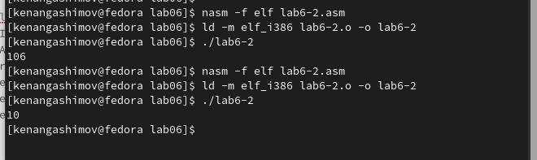{ #fig:008 width=70%, height=70% }

Заменил функцию iprintLF на iprint. Создал исполняемый файл и запустил его. 
Вывод отличается тем, что нет переноса строки.

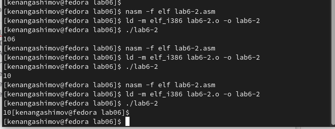{ #fig:009 width=70%, height=70% }

В качестве примера выполнения арифметических операций в NASM приведем 
программу вычисления арифметического выражения 
$f(x) = (5 * 2 + 3)/3$.

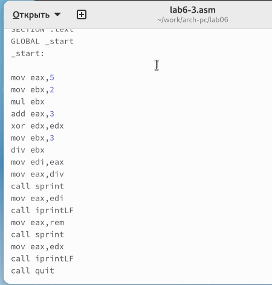{ #fig:010 width=70%, height=70% }

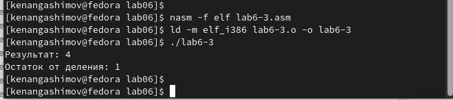{ #fig:011 width=70%, height=70% }

Изменил текст программы для вычисления выражения 
$f(x) = (4 * 6 + 2)/5$. 
Создал исполняемый файл и проверил его работу.

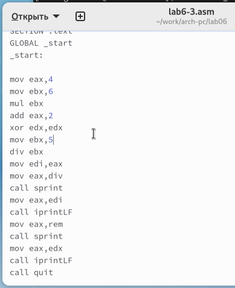{ #fig:012 width=70%, height=70% }

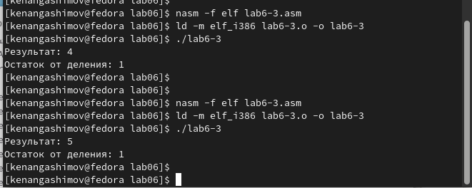{ #fig:013 width=70%, height=70% }

В качестве другого примера рассмотрим программу вычисления варианта задания по 
номеру студенческого билета.

В данном случае число, над которым нужно выполнить арифметические операции, 
вводится с клавиатуры. Как было отмечено ранее, ввод с клавиатуры осуществляется в 
символьном виде, и для правильной работы арифметических операций в NASM символы должны 
быть преобразованы в числа. Для этой цели можно использовать функцию atoi 
из файла in_out.asm.

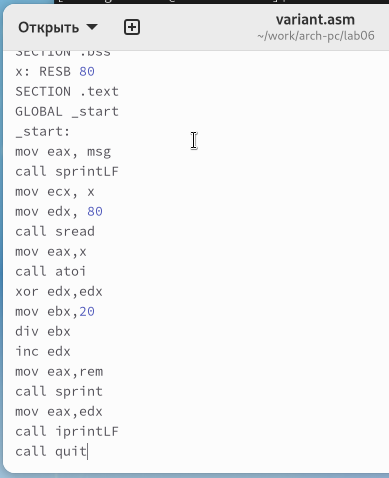{ #fig:014 width=70%, height=70% }

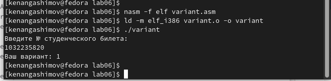{ #fig:015 width=70%, height=70% }

ответы на вопросы

1. Какие строки листинга отвечают за вывод на экран сообщения ‘Ваш вариант:’?

Строка "mov eax, rem" перекладывает значение переменной с фразой 'Ваш вариант:' в регистр eax.

Строка "call sprint" вызывает подпрограмму для вывода строки.

2. Для чего используется следующие инструкции?

Инструкция "mov ecx, x" используется для перемещения значения переменной x в регистр ecx.

Инструкция "mov edx, 80" используется для перемещения значения 80 в регистр edx.

Инструкция "call sread" вызывает подпрограмму для считывания значения студенческого билета из консоли.sread
  
3. Для чего используется инструкция “call atoi”?

Инструкция "call atoi" используется для преобразования введенных символов в числовой формат.

4. Какие строки листинга отвечают за вычисления варианта?

Строка "xor edx, edx" обнуляет регистр edx.

Строка "mov ebx, 20" записывает значение 20 в регистр ebx.

Строка "div ebx" выполняет деление номера студенческого билета на 20.

Строка "inc edx" увеличивает значение регистра edx на 1.

5. В какой регистр записывается остаток от деления при выполнении инструкции “div ebx”?

Остаток от деления записывается в регистр edx.

6. Для чего используется инструкция “inc edx”?

Инструкция "inc edx" используется для увеличения значения в регистре edx на 1, согласно формуле вычисления варианта.

7. Какие строки листинга отвечают за вывод на экран результата вычислений? 

Строка "mov eax, edx" перекладывает результат вычислений в регистр eax.

Строка "call iprintLF" вызывает подпрограмму для вывода значения на экран.

Написать программу вычисления выражения y = f(x). Программа должна выводить выражение 
для вычисления, выводить запрос на ввод значения x, 
вычислять заданное выражение в зависимости от введенного x, выводить результат вычислений. 
Вид функции f(x) выбрать из таблицы 6.3 вариантов заданий в соответствии с номером 
полученным при выполнении лабораторной работы. 
Создайте исполняемый файл и проверьте его работу для значений x1 и x2 из 6.3.

Получили вариант 1 - $(10 + 2x)/3$  для $x=1, x=10$

{ #fig:016 width=70%, height=70% }

Также размещаю код программы в отчете.

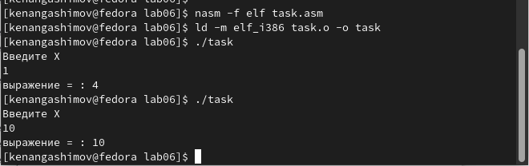{ #fig:017 width=70%, height=70% }

# Выводы

Изучили работу с арифметическими операциями.