---
## Front matter
title: "Отчёт по лабораторной работе 7"
subtitle: "Архитектура компьютеров и операционные системы"
author: "Кенан Гашимов НКАБд-02-23"

## Generic otions
lang: ru-RU
toc-title: "Содержание"

## Bibliography
bibliography: bib/cite.bib
csl: pandoc/csl/gost-r-7-0-5-2008-numeric.csl

## Pdf output format
toc: true # Table of contents
toc-depth: 2
lof: true # List of figures
lot: true # List of tables
fontsize: 12pt
linestretch: 1.5
papersize: a4
documentclass: scrreprt
## I18n polyglossia
polyglossia-lang:
  name: russian
  options:
	- spelling=modern
	- babelshorthands=true
polyglossia-otherlangs:
  name: english
## I18n babel
babel-lang: russian
babel-otherlangs: english
## Fonts
mainfont: PT Serif
romanfont: PT Serif
sansfont: PT Sans
monofont: PT Mono
mainfontoptions: Ligatures=TeX
romanfontoptions: Ligatures=TeX
sansfontoptions: Ligatures=TeX,Scale=MatchLowercase
monofontoptions: Scale=MatchLowercase,Scale=0.9
## Biblatex
biblatex: true
biblio-style: "gost-numeric"
biblatexoptions:
  - parentracker=true
  - backend=biber
  - hyperref=auto
  - language=auto
  - autolang=other*
  - citestyle=gost-numeric
## Pandoc-crossref LaTeX customization
figureTitle: "Рис."
tableTitle: "Таблица"
listingTitle: "Листинг"
lofTitle: "Список иллюстраций"
lotTitle: "Список таблиц"
lolTitle: "Листинги"
## Misc options
indent: true
header-includes:
  - \usepackage{indentfirst}
  - \usepackage{float} # keep figures where there are in the text
  - \floatplacement{figure}{H} # keep figures where there are in the text
---

# Цель работы

Целью работы является изучение команд условного и безусловного переходов. Приобретение навыков написания программ с использованием переходов. Знакомство с назначением и структурой файла листинга.

# Выполнение лабораторной работы

Создал каталог для программ лабораторной работы № 7 и файл lab7-1.asm.

В NASM инструкция jmp используется для осуществления безусловных переходов. 
Давайте рассмотрим пример программы, где используется инструкция jmp.

Написал текст программы из листинга 7.1 в файл lab7-1.asm.

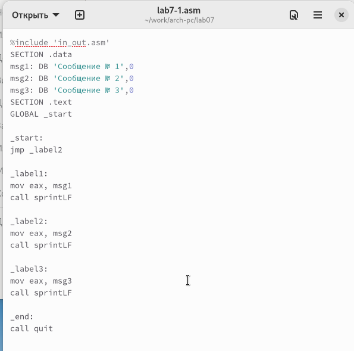{ #fig:001 width=70%, height=70% }

Создал исполняемый файл и запустил его.

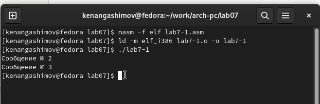{ #fig:002 width=70%, height=70% }

Инструкция jmp позволяет осуществлять переходы не только вперед, но и назад. 
Мы изменим программу так, чтобы она сначала выводила "Сообщение № 2", 
затем "Сообщение № 1" и завершала работу. Для этого мы добавим в текст программы 
после вывода "Сообщения № 2" инструкцию jmp с меткой _label1 
(переход к инструкциям вывода "Сообщения № 1") и после вывода "Сообщения № 1" 
добавим инструкцию jmp с меткой _end (переход к инструкции call quit).

Изменил текст программы в соответствии с листингом 7.2.

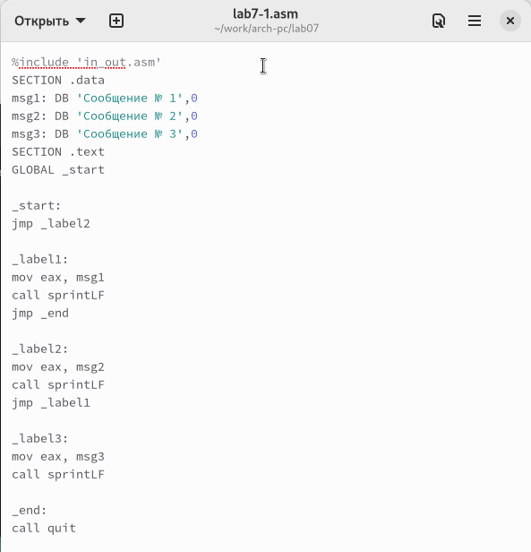{ #fig:003 width=70%, height=70% }

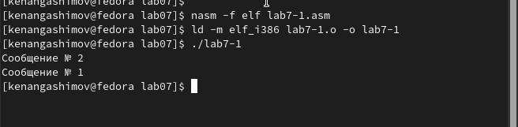{ #fig:004 width=70%, height=70% }

Изменил текст программы, изменив инструкции jmp, чтобы вывод программы был следующим:
```
Сообщение № 3
Сообщение № 2
Сообщение № 1
```

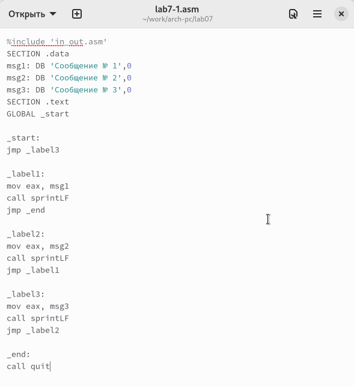{ #fig:005 width=70%, height=70% }

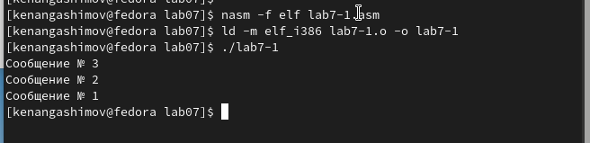{ #fig:006 width=70%, height=70% }

Использование инструкции jmp приводит к переходу в любом случае. 
Однако, при написании программ часто необходимо использовать условные переходы, 
то есть переход должен происходить, если выполнено определенное условие. 
Давайте рассмотрим программу, которая определяет и выводит на экран наибольшую из 
трех целочисленных переменных: A, B и C. Значения для A и C задаются в программе, 
а значение B вводится с клавиатуры.

Создал исполняемый файл и проверил его работу для разных значений B.

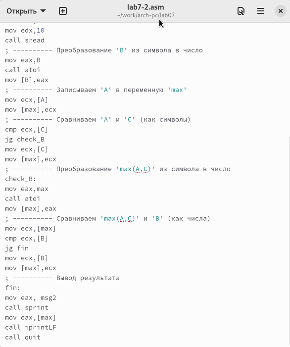{ #fig:007 width=70%, height=70% }

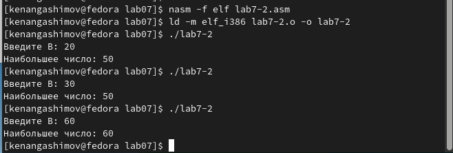{ #fig:008 width=70%, height=70% }

Обычно при ассемблировании с помощью nasm создается только объектный файл. 
Для получения файла листинга можно использовать ключ -l и указать имя файла листинга в командной строке.

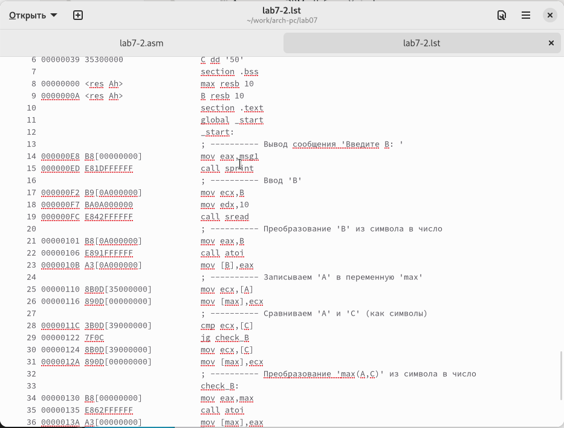{ #fig:009 width=70%, height=70% }

Я внимательно ознакомился с форматом и содержимым файла листинга. 
Подробно поясню некоторые элементы листинга.

**строка 168**

- 168 - номер строки

- 000000DB - адрес

- BB00000000 - машинный код

- mov ebx, 0 - Помещаем 0 в регистр ebx

**строка 169**

- 169 - номер строки

- 000000E0 - адрес

- B801000000 - машинный код

- mov eax, 1 - Помещаем 1 в регистр eax

**строка 170**

- 26 - номер строки

- 000000E5 - адрес

- CD80 - машинный код

- int 80h - вызов ядра

Открыл файл программы lab7-2.asm и в инструкции с двумя операндами удалил один из операндов. 
После этого я выполнил трансляцию программы и получил файл листинга.

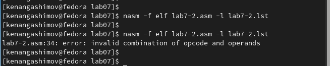{ #fig:010 width=70%, height=70% }

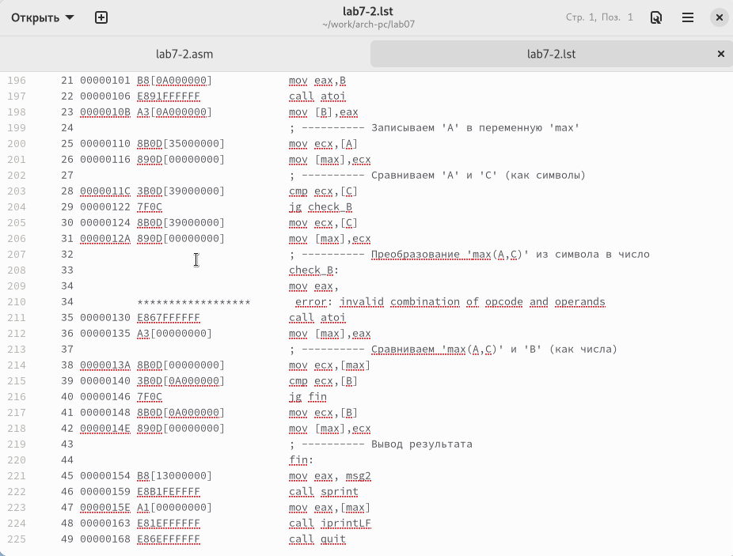{ #fig:011 width=70%, height=70% }

Хотя объектный файл не удалось создать из-за ошибки, я все же получил листинг, в котором указано место ошибки.

Напишите программу нахождения наименьшей из 3 целочисленных переменных a,b и c. 
Значения переменных выбрать из табл. 7.5 в соответствии с вариантом, полученным при выполнении лабораторной работы № 6.
Создайте исполняемый файл и проверьте его работу

для варианта 1 - 17, 23, 45

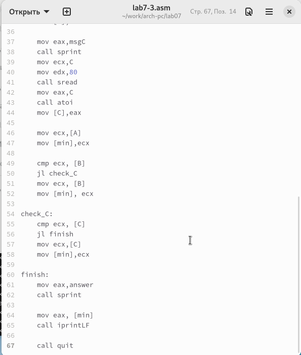{ #fig:012 width=70%, height=70% }

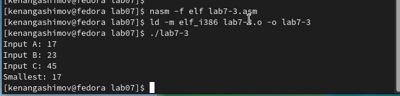{ #fig:013 width=70%, height=70% }

Напишите программу, которая для введенных с клавиатуры значений x и a вычисляет значение заданной функции f(x) и выводит результат вычислений. 
Вид функции f(x) выбрать из таблицы 7.6 вариантов заданий в соответствии с вариантом, полученным при выполнении лабораторной работы № 7. 
Создайте исполняемый файл и проверьте его работу для значений X и a из 7.6.

для варианта 1

$$
 \begin{cases}
	2*a - x, x < a
	\\   
	8, x \ge a
 \end{cases}
$$

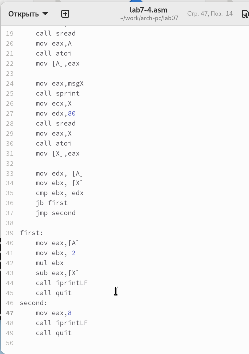{ #fig:014 width=70%, height=70% }

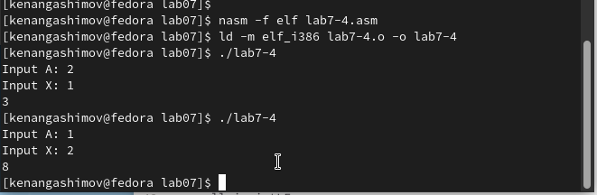{ #fig:015 width=70%, height=70% }

# Выводы

Изучили команды условного и безусловного переходов, познакомились с фалом листинга.