---
## Front matter
title: "Отчёт по лабораторной работе 8"
subtitle: "Архитектура компьютеров и операционные системы"
author: "Кенан Гашимов НКАБд-02-23"

## Generic otions
lang: ru-RU
toc-title: "Содержание"

## Bibliography
bibliography: bib/cite.bib
csl: pandoc/csl/gost-r-7-0-5-2008-numeric.csl

## Pdf output format
toc: true # Table of contents
toc-depth: 2
lof: true # List of figures
lot: true # List of tables
fontsize: 12pt
linestretch: 1.5
papersize: a4
documentclass: scrreprt
## I18n polyglossia
polyglossia-lang:
  name: russian
  options:
	- spelling=modern
	- babelshorthands=true
polyglossia-otherlangs:
  name: english
## I18n babel
babel-lang: russian
babel-otherlangs: english
## Fonts
mainfont: PT Serif
romanfont: PT Serif
sansfont: PT Sans
monofont: PT Mono
mainfontoptions: Ligatures=TeX
romanfontoptions: Ligatures=TeX
sansfontoptions: Ligatures=TeX,Scale=MatchLowercase
monofontoptions: Scale=MatchLowercase,Scale=0.9
## Biblatex
biblatex: true
biblio-style: "gost-numeric"
biblatexoptions:
  - parentracker=trueЗырянов Артём Алексеевич	НБИбд-01-22

  - backend=biber
  - hyperref=auto
  - language=auto
  - autolang=other*
  - citestyle=gost-numeric
## Pandoc-crossref LaTeX customization
figureTitle: "Рис."
tableTitle: "Таблица"
listingTitle: "Листинг"
lofTitle: "Список иллюстраций"
lotTitle: "Список таблиц"
lolTitle: "Листинги"
## Misc options
indent: true
header-includes:
  - \usepackage{indentfirst}
  - \usepackage{float} # keep figures where there are in the text
  - \floatplacement{figure}{H} # keep figures where there are in the text
---

# Цель работы

Целью работы является приобретение навыков написания программ с использованием циклов и обработкой аргументов командной строки..

# Выполнение лабораторной работы

1. Я создал каталог для программ лабораторной работы No8 и перешел в него. 
Далее создал файл lab8-1.asm.

2. Я написал в файле lab8-1.asm текст программы из листинга 8.1. 
После этого создал исполняемый файл и проверил его работу.

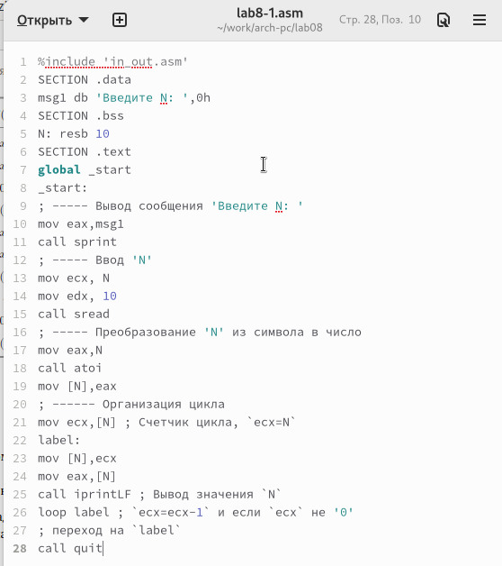{ #fig:001 width=70%, height=70% }

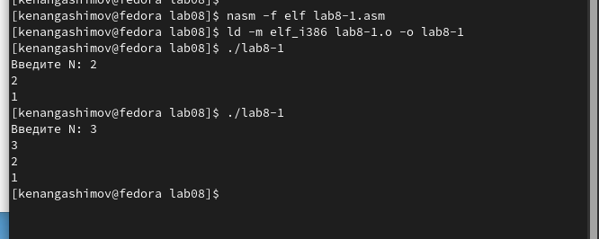{ #fig:002 width=70%, height=70% }

3. Этот пример показывает, что использование регистра ecx в теле цикла loop может п
ривести к некорректной работе программы. 

Я внес изменения в текст программы, добавив изменение значения регистра ecx в цикле. 
Затем создал исполняемый файл и проверил его работу. 
Программа запускала бесконечный цикл при нечетном значении N 
и выводила только нечетные числа при четном N.

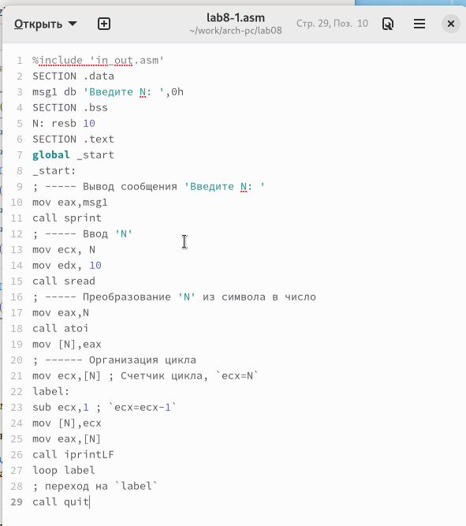{ #fig:003 width=70%, height=70% }

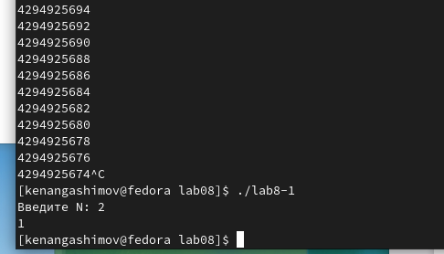{ #fig:004 width=70%, height=70% }

4. Для использования регистра ecx в цикле и сохранения корректности работы 
программы можно использовать стек. Я внес изменения в текст программы, 
добавив команды push и pop для сохранения значения счетчика цикла loop. 
После этого создал исполняемый файл и проверил его работу. 
Теперь программа выводила числа от N-1 до 0, и число проходов цикла соответствовало значению N.

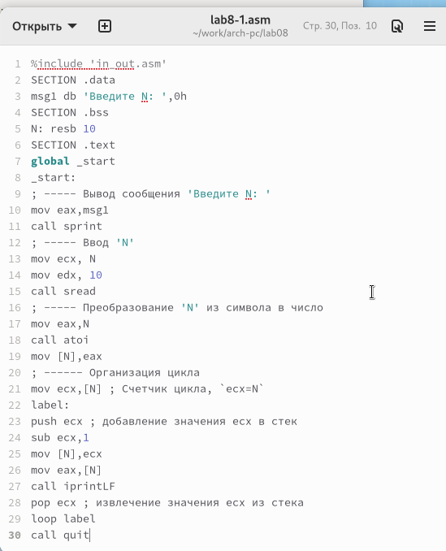{ #fig:005 width=70%, height=70% }

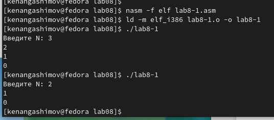{ #fig:006 width=70%, height=70% }

5. Я создал файл lab8-2.asm в каталоге ~/work/arch-pc/lab08 и ввел в него текст 
программы из листинга 8.2. Затем создал исполняемый файл, запустил его 
и указал 5 аргументов. Программа успешно обработала эти 5 аргументов.

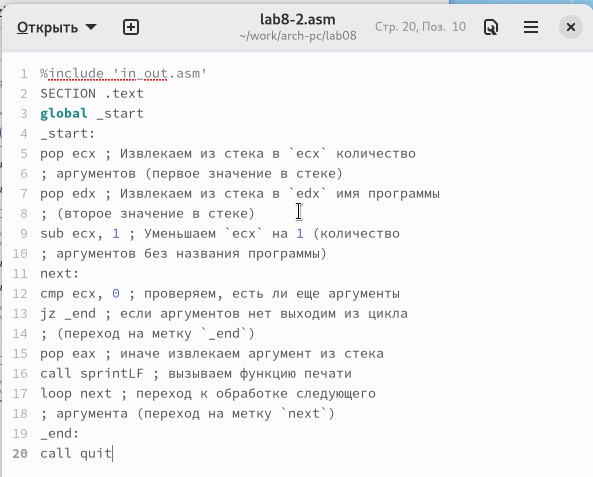{ #fig:007 width=70%, height=70% }

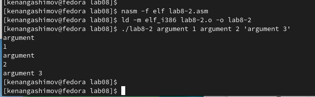{ #fig:008 width=70%, height=70% }

6. Рассмотрим ещё один пример программы, которая выводит сумму чисел, 
переданных в неё в качестве аргументов.

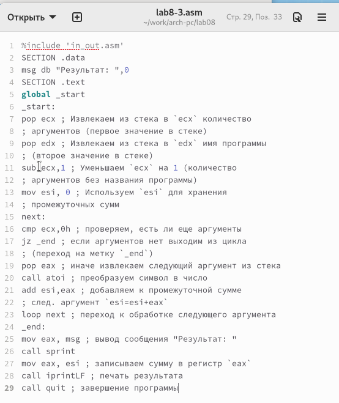{ #fig:009 width=70%, height=70% }

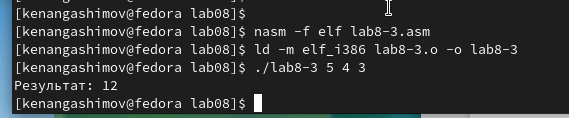{ #fig:010 width=70%, height=70% }

7. Я внёс изменения в текст программы из листинга 8.3, чтобы она вычисляла 
произведение аргументов командной строки.

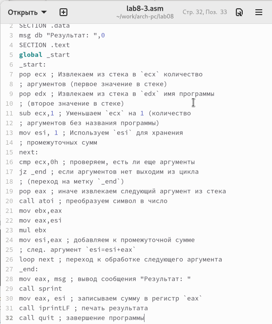{ #fig:011 width=70%, height=70% }

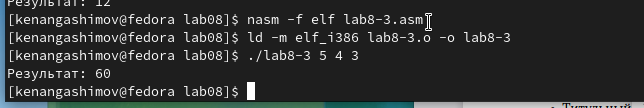{ #fig:012 width=70%, height=70% }

8. Написал программу, которая находит сумму значений функции f(x) для x = x1, x2
, ..., xn, т.е. программа должна выводить значение f(x1) + f(x2)+...+f(xn). Значения x передаются как аргументы. Вид функции f(x)
выбрать из таблицы 8.1 вариантов заданий в соответствии с вариантом, 
полученным при выполнении лабораторной работы № 7. 
Создал исполняемый файл и проверил его работу на нескольких наборах x.

для варивнта 1 $f(x) = 2x + 15$

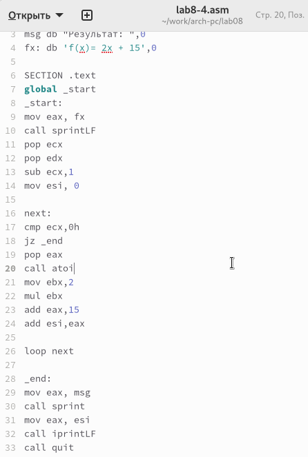{ #fig:013 width=70%, height=70% }

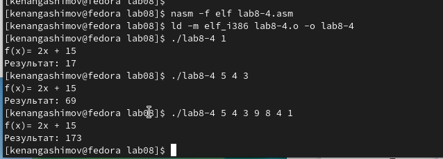{ #fig:014 width=70%, height=70% }

# Выводы

Освоили работы со стеком, циклом и аргументами на ассемблере nasm.
